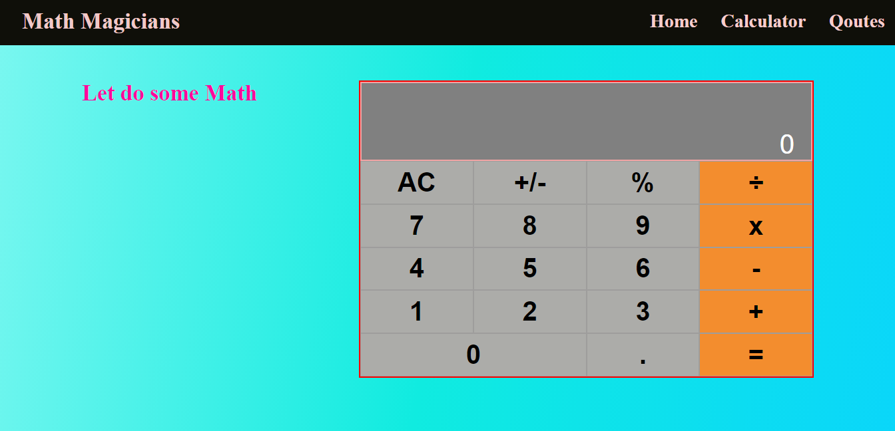

# Math-Magician

This is a calculator app build by react library.

## Built With

- ReactJS

## Video Walkthrough

## Get Live Demo

[Live Demo Netlify Link](https://glowing-naiad-81e0ba.netlify.app/)

## Clone and review it

Run the following commands to clone and run it.

### To clone the repository

  `git clone https://github.com/eerapheal/my-math-apps.git`

### To enter Directory

`cd my-math-apps`

### To Install Packages

`npm install`

### To run project on local server

`npm start`

### To run project tests

`npm test`

### To open project with vs code 

`code .`

## Authors

👤 **Ekpenisi Erue Raphael**

- GitHub: [@eerapheal](https://github.com/eerapheal)
- Twitter: [@ekpenisiraphael](https://twitter.com/ekpenisiraphael)
- LinkedIn: [ekpenisi-e-raphael-9678a221a](https://www.linkedin.com/in/ekpenisi-e-raphael-9678a221a/)

## 🤝 Contributing
Contributions, issues, and feature requests are welcome!
Feel free to check the [issues page](../../issues/).

## Show your support
Give a ⭐️ if you like this project!

## Acknowledgments
- Hat tip to anyone whose code was used
- Inspiration
- etc

## 📝 License
This project is [MIT](./MIT.md) licensed.